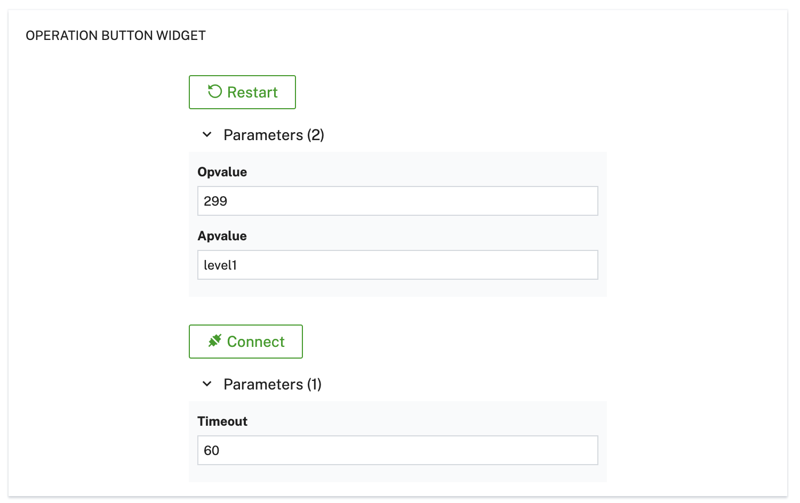

# Cumulocity Operation Widget

## Purpose

This widget plugin allows you to send operations to a selected device in Cumulocity. Key features include:

- **Device Selection**: Choose a target device to send operations to
- **Configurable Parameters**: Define custom parameters for each operation
- **Dynamic UI**: Update parameter values directly in the UI when invoking the operation
- **Easy Integration**: Install as a plugin to any Cumulocity application

 

 